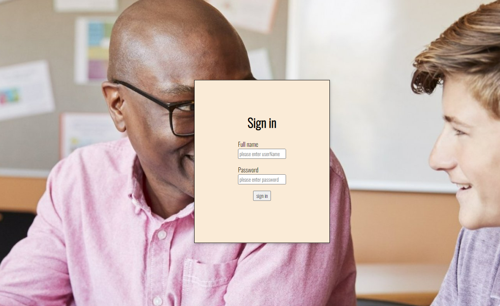
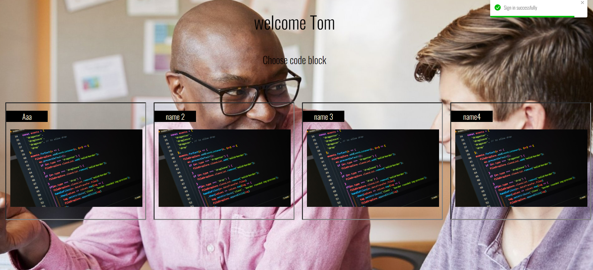
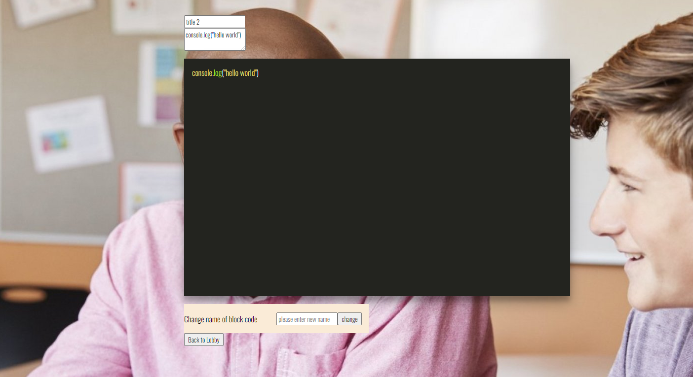
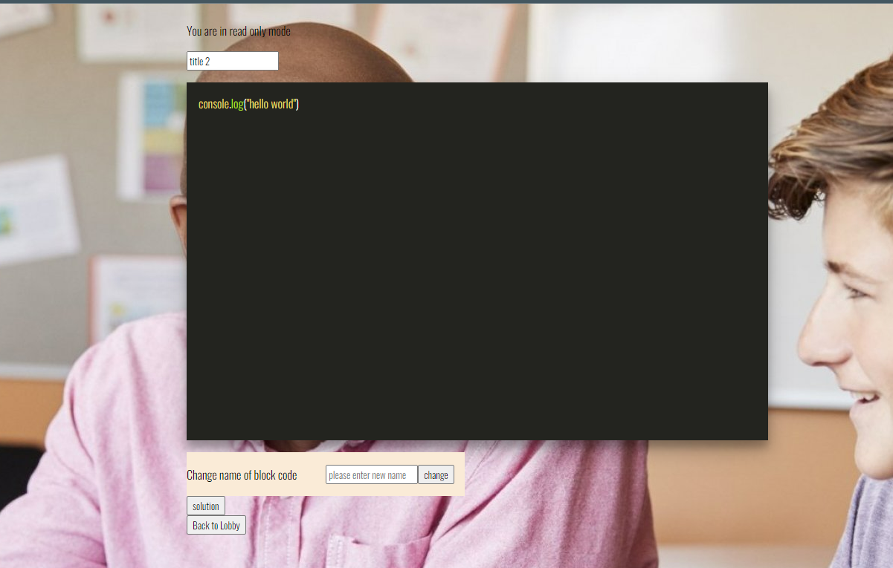

# Moveo_project

### Technologies in use - 👩‍💻👨‍💻

- **[React](https://reactjs.org/) - For the frontend**
- **[TypeScript](https://www.typescriptlang.org/) - As a programming language**
- **[React Router DOM](https://www.npmjs.com/package/react-router-dom) - To create single page app**
- **[Redux](https://redux.js.org/) - for state management**
- **[Docker](https://www.docker.com/) - For global use**
- **[Socket.io](https://socket.io/) - For live connection**

#### Packages 📦

##### Front-end

- **[Axios](https://www.npmjs.com/package/axios) - For API requests**
- **[react-toastify](https://www.npmjs.com/package/react-toastify) - for nice popUp messages**
- **[Socket.io-client](https://socket.io/docs/v4/client-api/) - For client server connection**

##### Back-end

- **[ts-node-dev](https://www.npmjs.com/package/ts-node-dev) and [ts-node](https://www.npmjs.com/package/ts-node)**
- **[Express](https://www.npmjs.com/package/express)**
- **[Socket.io](https://socket.io/) - For client server connection**
- **[Cors](https://www.npmjs.com/package/cors)**
- **[mongoose](https://www.npmjs.com/package/nanoid) - For mongoDB**

---

## My app -

#### Link to heroku- [Heroku](https://moveo-task-ori.herokuapp.com/) ⭐

## Features - 💫

### Login

- _Login with Tom password and username_ 👤

### Lobby

- *4 items which represents code blocks*📝
- _Mentor can Choose code block_ 📝
- _Mentor gets a unique link for him and the student which will take their both to the code block page_

## Code block for stuednt

- _Code block that change at real time_
- _Student can change the title of the code block_
- _Student can change the name of the code block_

## Code block for user

- _Mmentor can see the code changes in real time_
- _Mentor can can change the title of the code block_
- _Mentor can change the name of the code block_
- _Mentor can check the student code and to Confirm to the student his solution_

# Screenshots 📸 -

## Login 🔐

## Lobby 📝

### Code block for student

### Code block for mentor

